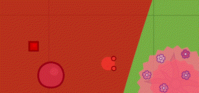
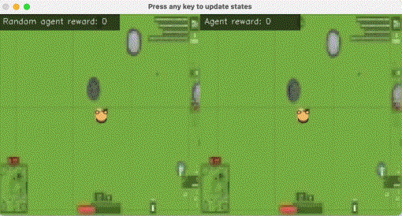
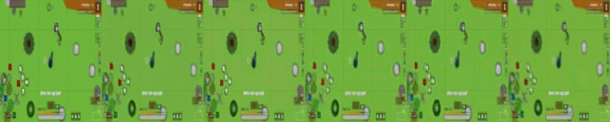
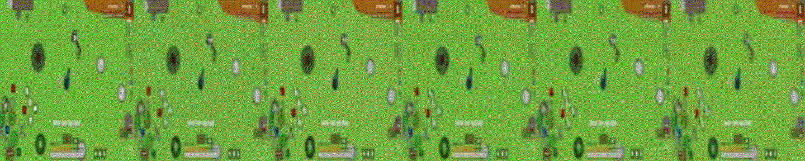

<div align="center">
  



[](https://opensource.org/licenses/MIT)
  
[]()
[]()
[]()
  
</div>

<div align="center">
  
*This repo is support for [a global project](https://github.com/Laggg/ml-bots-surviv.io) - to create a smart ML bot for a browser-based multiplayer online game in the genre of battle royale [surviv.io](https://surviv.io/) which would be interesting to watch*  
  
</div>

## Neural environment for training an RL-agent by using expert trajectories only
Game [surviv.io](https://surviv.io/) does not have any environment in which it would be possible to train an RL agent. Environment is a function that gets the current state and the agent's action and returns the next state and reward: **state_next,reward=ENV(state_curr,action)**. That's why we present:
1. **our neural environment** (deep learning models) which perform all required features of the real game environment needed for training bots locomotion.
2. **our DQN RL bot** (trained in neural engine) which aims to run up to all the stones that fall into his field of vision. We will use this proof-of-concept technology to train our agent to loot vital items and other skills in [a global project](https://github.com/Laggg/ml-bots-surviv.io).

### Motivation
In all our experiments **environment state is the RGB frame**. The development of this technology will allow some designed robots to be trained in cooking/cleaning/repairing with huge video information from YouTube and twitch.

### Playable demo app
We present an interactive demo application to demonstrate the work of a neural engine with the ability to control the movement of the agent by the user. Moreover, in this application, the user can watch the game of a trained RL agent. Main goal our bot - to run up to all the stones that fall into his field of vision. Anyone can run interactive demo application on their machine (see below installation guides).

<details>
  <summary>Windows installation guides</summary>
 
  **For windows users we offer to compete with our trained RL agent. Main goal is to collect a reward for running up to the stones at the frame for the same number of steps. Good luck, have fun!**
  
  
  
  #### *Initial usage*
  __1. In anaconda prompt: dowland or clone this GitHub repository__
  
  __2. Create python virtual environment and install requirements__
  
  ```
  conda create -n survivio_venv python=3.8
  conda activate survivio_venv
  python -m pip install -r requirements.txt
  ```
  
  __3. Run the agent__
  ```
  python run_demo.py
  ```
  
  #### *Later usage*
  __1. Activate python environment__
  ```
  source survivio_venv/bin/activate
  ``` 

  __2. Run the agent__
  ```
  python run_demo.py
  ```
</details>

<details>
  <summary>Ubuntu\MacOS installation guides</summary>
  
  **For ubuntu\mac OS users we offer to compare a random agent with our trained RL agent. Main goal agents is to collect a reward for running up to the stones at the frame for the same number of steps. Press any key to update agents states. Just watch and have fun!**
  
  
  
  #### *Initial usage*
  __1. In terminal: clone GitHub repository__
  
  ```
  git clone https://github.com/Laggg/neural_env_surviv
  ```
  
  __2. Create python virtual environment and install requirements.txt__
  
  ```
  cd neural_env_surviv
  python -m venv survivio_venv
  source survivio_venv/bin/activate
  python -m pip install -r requirements.txt
  ```
  
  __3. Run the agent__
  ```
  python run_demo.py
  ```
  
  #### *Later usage*
  __1. Activate python environment__
  ```
  source survivio_venv/bin/activate
  ``` 

  __2. Run the agent__
  ```
  python run_demo.py
  ```
</details>

### Our DL CV experiments
<details>
  <summary>Experiments demo</summary>

    Сравнение генеративных моделей S_next=model(S_curr,action) (плашки гифок слева направо):
      - init state (RGB frame)
      - Loss = 0*Lgan + MSE
      - Loss = 0*Lgan + MSE + PL/100
      - Loss = 0*Lgan + MAE + PL/100
      - Loss = 0*Lgan + 3*MAE + PL/100 (best, in DemoApp)
      - Loss = Lgan/100 + 3*MAE + PL/100 (pix2pix)
  
<div align="center">
 


</div>
  
    Другие эксперименты для generative models without GAN (плашки гифок слева направо):
      - 3*MAE+PL/100+1*SSIM
      - 3*MAE+PL/100+1*LPIPS
      - 3*MAE+PL/100+PieAPP(stride=10)/4
      - 3*MAE+PL/100+PieAPP(stride=7)/2
      - 3*MAE+PL/100+2*HaarPSI
      - 3*MAE+PL/100+2*SSIM (веса утеряны, метрики хуже)
      - 3*MAE+PL/100+3*DISTS (веса утеряны, метрики хуже)
  
<div align="center">
 



</div>
  
  - [x] 1. generative models without GAN
  - [x] 2. additional [losses](https://www.youtube.com/watch?v=nUjIG41M8fM), /mssim/style-texture loss/perceptual path length/
  - [x] 3. generative models with GAN (pix2pix) 
  - [x] 4. VQ-VAE/[GameGAN](https://nv-tlabs.github.io/gameGAN/)/[Dreamer2](https://youtu.be/o75ybZ-6Uu8?t=2)
  - [x] 5. **RL** для приближения агента к кустам/камням/луту (в зависимости от качества нейронного движка)
  - [x] 6. интерактивный фронт для взаимодействия человека с нейронным движком (чтобы можно было поиграть игру, движком которой была бы нейронка)  
  
</details>


### Team [Presentation](https://docs.google.com/presentation/d/176bLsm6STRzftdZm-Kvl76hQlraToL7J8sXfhbsi0wg/edit?usp=sharing)
1. Dmitry Fomin (RL) ods: @dfomin tg: @dfomin
2. Pavel Danilov (FD) ods: @Pavel tg: @KalabiYauu
3. Dmitry Gaus   (CV) ods: @QwertyNice tg: @QwertyNice
4. Klokov Alexey (CV,RL), ods: @laggg tg: @laggg5
