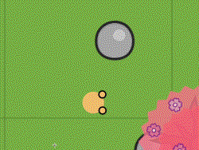
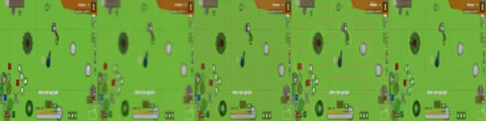
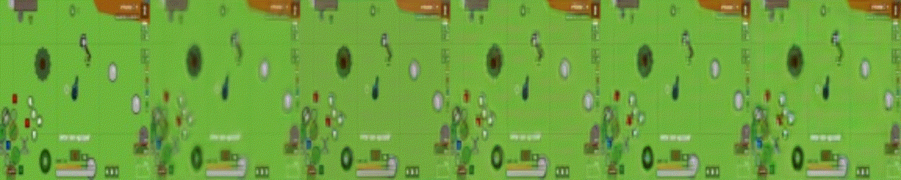

  

  
*This repo is support for [a global project](https://github.com/Laggg/ml-bots-surviv.io) - to create a smart ML bot for a browser-based multiplayer online game in the genre of battle royale [surviv.io](https://surviv.io/) which would be interesting to watch*  
  

## Neural environment for training an RL-agent by using expert trajectories only
Game [surviv.io](https://surviv.io/) does not have any environment in which it would be possible to train an RL agent. Environment is a function that gets the current state and the agent's action and returns the next state and reward: **state_next,reward=ENV(state_curr,action)**. We present our neural environment (deep learning models) which perform all required features of the real game environment needed for training RL-agents locomotion. For an example of using a neural environment, we present DQN RL agent (trained in our neural engine) who aims to run up to all the stones that fall into his field of vision. We will use this proof-of-concept technology to train our agent to loot vital items and other skills in [a global project](https://github.com/Laggg/ml-bots-surviv.io).

### Motivation
In all our experiments **environment state is the RGB frame**. The development of this technology will allow some designed robots to be trained in cooking/cleaning/repairing with huge video information from YouTube and twitch.

### Demo App
We present an interactive demo application to demonstrate the work of a neural engine with the ability to control the movement of the agent by the user. Moreover, in this application, the user can watch the game of a trained RL agent. Main goal our trained agent - to run up to all the stones that fall into his field of vision.

### DL experiments
- [x] 1. generative models without GAN
- [x] 2. generative models with GAN (pix2pix)
- [x] 3. VQ-VAE/[GameGAN](https://nv-tlabs.github.io/gameGAN/)/[Dreamer2](https://youtu.be/o75ybZ-6Uu8?t=2)
- [x] 4. additional [losses](https://www.youtube.com/watch?v=nUjIG41M8fM), /mssim/style-texture loss/perceptual path length/
- [x] 5. **RL** для приближения агента к кустам/камням/луту (в зависимости от качества нейронного движка)
- [x] 6. интерактивный фронт для взаимодействия человека с нейронным движком (чтобы можно было поиграть игру, движком которой была бы нейронка)

Сравнение генеративных моделей **S_next=model(S_curr,action)** (слева направо):
  - init state (RGB frame)
  - Loss = 0\*Lgan + MSE
  - Loss = 0\*Lgan + MSE + PL/100
  - Loss = 0\*Lgan + MAE + PL/100
  - Loss = 0\*Lgan + 3\*MAE + PL/100 (best, in DemoApp)
  - Loss = Lgan/100 + 3\*MAE + PL/100 (pix2pix)
 

 

