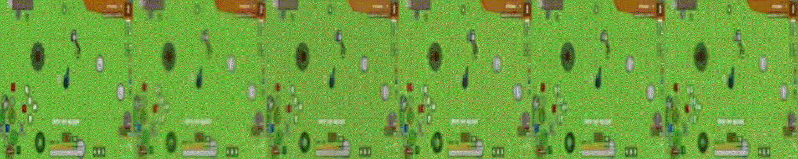

<div align="center">
  


[](https://opensource.org/licenses/MIT)

</div>

<div align="center">
  
*This repo is support for [a global project](https://github.com/Laggg/ml-bots-surviv.io) - to create a smart ML bot for a browser-based multiplayer online game in the genre of battle royale [surviv.io](https://surviv.io/) which would be interesting to watch*  
  
</div>

## Neural environment for training an RL-agent by using expert trajectories only
Game [surviv.io](https://surviv.io/) does not have any environment in which it would be possible to train an RL agent. Environment is a function that gets the current state and the agent's action and returns the next state and reward: **state_next,reward=ENV(state_curr,action)**. That's why we present:
1. **our neural environment** (deep learning models) which perform all required features of the real game environment needed for training bots locomotion.
2. **our DQN RL bot** (trained in neural engine) which aims to run up to all the stones that fall into his field of vision. We will use this proof-of-concept technology to train our agent to loot vital items and other skills in [a global project](https://github.com/Laggg/ml-bots-surviv.io).

### Motivation
In all our experiments **environment state is the RGB frame**. The development of this technology will allow some designed robots to be trained in cooking/cleaning/repairing with huge video information from YouTube and twitch.

### Demo App
We present an interactive demo application to demonstrate the work of a neural engine with the ability to control the movement of the agent by the user. Moreover, in this application, the user can watch the game of a trained RL agent. Main goal our bot - to run up to all the stones that fall into his field of vision.

# Installation guides

<details>
  <summary>Ubuntu\MacOS</summary>
  
  ## Initial usage
  __1. Clone GitHub repository__
  
  ```
  git clone https://github.com/Laggg/ml-bots-surviv.io
  ```

  __2. Download supporting files__

  Download model weights from [here](https://drive.google.com/u/0/uc?id=1l3exfxwT4ZVk1R6V2sxZimTafx1EkNtO&export=download) and chromedriver, that suits your chrome version, from [here](https://chromedriver.chromium.org/downloads) (unzip it, if needed). 

  Locate both files to `./supporting_files/` folder.

  >
  
  __3. Create python virtual environment and install requirements.txt__
  
  ```
  cd ml-bots-surviv.io
  python -m venv surviv_env 
  source surviv_env/bin/activate
  pip install -r requirements.txt 
  ```
  <details>
    <summary>possible issues: </summary>
    
    Issue: Could not build wheels for opencv-python which use PEP 517 and cannot be installed directly
    Solution: `pip install --upgrade pip setuptools wheel`
  </details>


  __4. Run the agent__
  ```
  python play.py
  ```
  
  ## Later usage

  __1. Activate python environment__
  ```
  source surviv_env/bin/activate
  ``` 

  __2. Run the agent__
  ```
  python play.py
  ```
</details>

<details>
  <summary>Windows</summary>
  
  ### Before the first launch
  
  **1.** Check that you have `Anaconda3` with `python3`

  **2.** Check that you have `google chrome browser` (our agent supports only chrome)

  ### For the first launch
  
  **0.** Earlier you do 1-2 steps from paragraph **"Before the first launch"**

  **1.** Clone repo by `Anaconda Prompt` or dowland zip-file repo and unzip it
  ```
  git clone https://github.com/Laggg/ml-bots-surviv.io.git
  ```
  **2.** Dowland neural net weights from [source](https://drive.google.com/u/0/uc?id=1l3exfxwT4ZVk1R6V2sxZimTafx1EkNtO&export=download) and put it into `./supporting_files/` folder

  **3.** Dowland driver for your OS and for your chrome version (don't forget to check your google chrome version!) from [link](https://chromedriver.chromium.org/downloads), unzip it and put into `./supporting_files/` folder

  > after 3rd step you can check `./supporting_files/` folder:
  >> 

  **4.** Open Anaconda prompt inside repo-folder
  > example:
  >> 

  **5.** Create a virtual environment for this project
  ```
  python –m venv surviv_env
  ```
  **6.** Activate created virtual environment
  ```
  cd surviv_env/scripts && activate && cd ../../
  ```
  **7.** Install all required libraries
  ```
  pip install -r requirements.txt
  ```
  **8.** Launch the agent into the game!
  ```
  python play.py
  ```
  **9.** After all you can deactivate virtual env and close `Anaconda prompt` window

  ### For the second+ launch
  
  **0.** Earlier you do 1-9 steps from paragraph **"For the first launch"**

### DL experiments
- [x] 1. generative models without GAN
- [x] 2. generative models with GAN (pix2pix)
- [x] 3. VQ-VAE/[GameGAN](https://nv-tlabs.github.io/gameGAN/)/[Dreamer2](https://youtu.be/o75ybZ-6Uu8?t=2)
- [x] 4. additional [losses](https://www.youtube.com/watch?v=nUjIG41M8fM), /mssim/style-texture loss/perceptual path length/
- [x] 5. **RL** для приближения агента к кустам/камням/луту (в зависимости от качества нейронного движка)
- [x] 6. интерактивный фронт для взаимодействия человека с нейронным движком (чтобы можно было поиграть игру, движком которой была бы нейронка)

Сравнение генеративных моделей **S_next=model(S_curr,action)** (слева направо):
  - init state (RGB frame)
  - Loss = 0\*Lgan + MSE
  - Loss = 0\*Lgan + MSE + PL/100
  - Loss = 0\*Lgan + MAE + PL/100
  - Loss = 0\*Lgan + 3\*MAE + PL/100 (best, in DemoApp)
  - Loss = Lgan/100 + 3\*MAE + PL/100 (pix2pix)
 
<div align="center">
 



</div>
